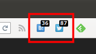

# mini SocialButton

firefoxのツールバーにはてなブックマークとTwitterのソーシャルカウント付きのボタンを設置するアドオンです。

ボタンをクリックするとそれぞれのサービスのコメント一覧ページを別タブで開きます。

## 動作環境

firefox36以上で動作します。

## インストール

[公式サイト](https://addons.mozilla.org/ja/firefox/addon/mini-socialbutton/)からインストールできます。

## 仕様 & 既知の不具合

カウント数の表示にはActionButtonの`badge`プロパティを使用していますが、結構新しめの機能(firefox36から実装)なのでいくつか仕様というか不具合のようなものがあります。

1. ツールバー上では最大4桁までしか表示されないようです。したがって、カウント数が10000以上の場合は9999として背景を赤くするようにしています。
2. ツールバーからメインメニューにアイコンを移動させるとメインメニューの表示がおかしくなることがあります(何も表示されなくなる)。メニューのカスタマイズでアイコンを外せばメニュー表示は元に戻ります。

## その他

個人的にはこの2つのサービスの数字さえ見れれば満足なんですが、要望があれば他のサービスのボタンも追加するかもしれません。しないかもしれません。

## 謝辞

* コンセプト、基本機能に関しては[あすかぜ・ねっと](http://www.asukaze.net/etc/jetpack/)様のサンプルコード`simple-hatebu`を参考にさせて頂きました。
* 各種サービスのアイコンは[ヴォルフロッシュ様のミニ・ソーシャル・アイコン](http://wolfrosch.com/works/webdesign/socialicons)から利用させて頂きました。

## License

MIT
